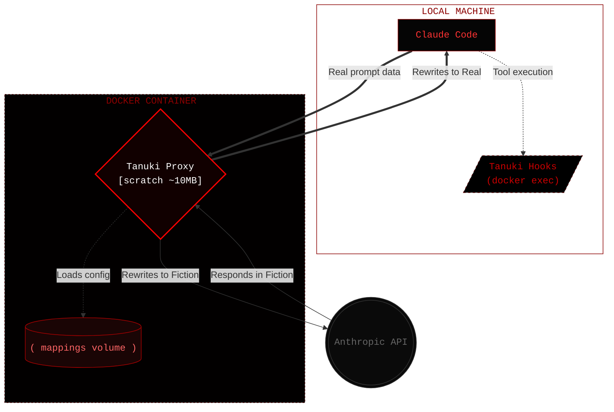

<div align="center">

# Tanuki


<i>"The greatest craft is to hide craft."</i><br/>
<sub>Thomas Fuller</sub>

**Proxy for AI-assisted security testing/privacy**

[](https://github.com/Pigyon/tanuki/releases/latest)
[](https://github.com/Pigyon/tanuki/actions/workflows/ci.yml)
[](https://github.com/Pigyon/tanuki/pkgs/container/tanuki)

[](https://go.dev)
[](https://www.docker.com/)
[](#quick-start)
[](#architecture)
[](LICENSE)

</div>

---

Tanuki sits between your local **Claude Code** agent and the **Anthropic API**, rewriting every target-identifying string in real time. Your tools hit the real target; the model only ever sees a fictional localhost project.

## Table of Contents

- [Overview](#overview)
- [How it works](#how-it-works)
- [Example](#example)
- [Quick start](#quick-start)
- [Configuration](#configuration)
- [CLI reference](#cli-reference)
- [What gets rewritten](#what-gets-rewritten)
- [Environment variables](#environment-variables)
- [Architecture](#architecture)
- [Known limitations](#known-limitations)
- [Fail-closed behaviour](#fail-closed-behaviour)
- [Disclaimer](#disclaimer)
- [License](#license)

## Overview

Tanuki is an anonymization proxy built for AI-assisted security testing and bug bounty hunting. When you drive an agent like Claude Code through a pentest, every real domain, IP, and payload in your prompts leaves your machine. That's an OpSec risk, and it can also breach bug bounty program rules or an NDA.

Tanuki runs as a Docker container and transparently intercepts that API traffic. Before a prompt leaves your machine, it swaps real target data (domains, subdomains, IPs, emails, paths, cloud identifiers, and aggressive security terminology) for harmless fictional development equivalents. When the model responds, the fiction is mapped back to reality so your local tools execute against the real targets. The model believes it is helping you debug a local dev application, and the upstream provider is blind to your actual engagement.

## How it works



| Direction      | Path                    | What happens                                                                                                                                                             |
| -------------- | ----------------------- | ------------------------------------------------------------------------------------------------------------------------------------------------------------------------ |
| **Inbound**    | your prompt → API       | Domains, org names, emails, IPs, paths, cloud identifiers, and pentest terminology are replaced with localhost fiction before the model sees them.                       |
| **Outbound**   | API → Claude Code       | Fiction terms are rewritten back to real values in the response stream, so Claude Code's local tools receive real target data.                                           |
| **Tool calls** | hooks via `docker exec` | Bidirectional rewriting around tool execution: fiction→real before (so tools hit actual targets), real→fiction after (so the model never sees real data in tool output). |

## Example

You're testing `bounty.amazon.com`. Here's what Tanuki does:

| You type (real)         | LLM sees (fiction)           |
| ----------------------- | ---------------------------- |
| `amazon.com`            | `localhost:9000`             |
| `bounty.amazon.com`     | `localhost:9002`             |
| `any-other.amazon.com`  | `localhost:9001` (wildcard)  |
| `admin@amazon.com`      | `admin@devtarget.local`      |
| `Amazon`                | `DEVTARGET`                  |
| `52.94.236.248`         | `127.0.0.3`                  |
| `/var/www/amazon/`      | `/var/www/dev/devtarget/`    |
| `s3://amazon-prod`      | `file:///tmp/devtarget-prod` |
| `SQL injection`         | `parameterized query test`   |
| `reverse shell`         | `remote debug session`       |

Each target domain gets three mappings: the base domain, a wildcard for
subdomains that have not been seen yet, and a dedicated mapping per
subdomain as it is detected. The wildcard is what stops an unmapped host
like `internal-admin.amazon.com` from leaking its label upstream.

## Quick start

```bash
git clone https://github.com/Pigyon/tanuki.git
cd tanuki
docker compose up -d
claude
```

That pulls the latest published image from GitHub Container Registry, so no Go toolchain and no build are needed.

To build from source instead of pulling:

```bash
docker compose -f compose.yaml -f compose.dev.yaml up -d --build
```

On startup the proxy auto-configures the Claude Code hooks and proxy env in `.claude/settings.json`, and writes the cover-story `.claude/CLAUDE.md`. Domains, emails, and IPs are **auto-detected** from your conversation, so no manual target configuration is needed.

When you type _"check bounty.amazon.com for SQL injection"_, the `UserPromptSubmit` hook:

1. Detects `amazon.com` and `bounty.amazon.com` as new domains
2. Creates all derivative mappings (org, email, path, cloud, ticket)
3. Hands off to the proxy, which rewrites the prompt before it reaches the API

### Wrapper script

A `./tanuki` wrapper is included so you don't have to type `docker compose exec tanuki /tanuki <command>`:

```bash
./tanuki add example.com
./tanuki map
./tanuki status
```

### Verify rewriting

Test the rewriting engine without hitting the API:

```bash
./tanuki test "scan bounty.amazon.com for SQL injection and contact admin@amazon.com"
```

## Configuration

Everything is optional; without it, targets are auto-detected from your conversation. To pre-configure an engagement, edit `compose.yaml`:

```yaml
environment:
  # Custom fiction org name (default: DEVTARGET)
  - TANUKI_FICTION_ORG=ACMECORP
  # Pre-seed target domains (comma-separated)
  - TANUKI_DOMAINS=example.com,api.example.com
  # Pre-seed target IPs (comma-separated)
  - TANUKI_IPS=93.184.216.34
  # Custom rewrite rules (semicolon-separated, pipe-delimited real|fiction)
  - TANUKI_RULES=John Smith|Jane Developer;Project Phoenix|Test Alpha
```

### Custom rewrite rules

For strings that aren't domains or IPs (people, project names, internal jargon), add custom rules via `compose.yaml` (applied on every container start) or at runtime:

```bash
./tanuki add-rule "John Smith" "Jane Developer"
./tanuki add-rule "Project Phoenix" "Test Alpha"
```

### Named engagements

For separate projects or custom fiction org names:

```bash
./tanuki init bugbounty --fiction-org ACMECORP
./tanuki add bounty.amazon.com
```

## CLI reference

All commands run via `./tanuki <command>` (or `docker compose exec tanuki /tanuki <command>`):

| Command                             | Description                                        |
| ----------------------------------- | -------------------------------------------------- |
| `setup`                             | Configure Claude Code hooks (automatic on startup) |
| `init <name> [--fiction-org NAME]`  | Create a named engagement                          |
| `add <domain> [--fiction-org NAME]` | Pre-seed a target domain                           |
| `add-ip <ip>`                       | Pre-seed an IP mapping                             |
| `add-rule <real> <fiction>`         | Add a custom rewrite rule                          |
| `map`                               | Show the current mapping table                     |
| `status`                            | Show engagement info                               |
| `list`                              | List all engagements                               |
| `activate <name>`                   | Switch the active engagement                       |
| `test <text>`                       | Test rewriting on sample text                      |
| `terms`                             | Show terminology mappings                          |
| `export [name]`                     | Export an engagement as JSON                       |
| `import <file.json>`                | Import an engagement from JSON                     |
| `reset [--data]`                    | Remove hooks (`--data` also wipes engagements)     |
| `version`                           | Show version and build info                        |
| `proxy`                             | Run the proxy server (container entrypoint)        |

## What gets rewritten

### Mapping-based (per engagement, all auto-detected)

| Type            | Detection                              | Fiction                    |
| --------------- | -------------------------------------- | -------------------------- |
| Domains         | Auto-detected in prompts & tool output | `localhost:<port>`         |
| Org names       | Derived from domain                    | `DEVTARGET` (configurable) |
| Emails          | Derived from domain                    | `user@devtarget.local`     |
| IPs (v4 + v6)   | Auto-detected in prompts & tool output | `127.0.0.x` / `::ffff:...` |
| Paths           | Derived from org name                  | `/dev/devtarget/`          |
| Cloud resources | Derived from org name                  | `file:///tmp/devtarget...` |
| Ticket prefixes | Derived from org name                  | `DT-`                      |
| Custom rules    | User-defined via env or CLI            | User-defined               |

### Terminology (built-in, applied to all engagements)

Compound pentest-specific terms are replaced with neutral dev equivalents. Only unambiguous multi-word terms are replaced. Single words like _target_, _payload_, or _exploit_ are left alone so legitimate code discussions don't break.

Run `./tanuki terms` to see the full dictionary. The list lives in `internal/tanuki/terminology.json` and is embedded at build time; to customize it, edit the file and rebuild.

## Environment variables

Set in `compose.yaml`:

| Env var              | Default                     | Description                                              |
| -------------------- | --------------------------- | -------------------------------------------------------- |
| `TANUKI_DATA`        | `/data`                     | Engagement data directory (volume)                       |
| `TANUKI_PROXY_PORT`  | `18080`                     | Proxy listen port                                        |
| `TANUKI_PORT_START`  | `9000`                      | Starting port for domain assignments                     |
| `TANUKI_UPSTREAM`    | `https://api.anthropic.com` | Upstream API URL                                         |
| `TANUKI_FICTION_ORG` | `DEVTARGET`                 | Fiction org name for mappings                            |
| `TANUKI_DOMAINS`     | _(none)_                    | Comma-separated domains to pre-seed                      |
| `TANUKI_IPS`         | _(none)_                    | Comma-separated IPs to pre-seed                          |
| `TANUKI_RULES`       | _(none)_                    | Custom rules: `real\|fiction` pairs, semicolon-separated |
| `TANUKI_DEBUG`       | _(none)_                    | Set to any non-empty value to enable debug logging       |

## Architecture

**Container:** `scratch`-based image with a single static Go binary plus CA certs. No OS, no shell, no runtime, ~10MB total. All capabilities dropped, read-only filesystem, no privilege escalation.

**Everything runs in Docker.** The proxy, hooks, and CLI all execute inside the container; hooks are invoked by Claude Code via `docker exec`, so no host-side binary is needed.

**Matching:** an Aho-Corasick automaton does longest-first replacement in a single pass over the stream.

## Known limitations

- **No HTTPS on the proxy.** The proxy listens on plain HTTP. That's acceptable because it only accepts connections from localhost (Claude Code on the same machine); the upstream connection to the Anthropic API uses HTTPS.
- **Literal string matching only.** Encoded forms (URL-encoded, base64, and similar) won't be caught by the Aho-Corasick automaton.
- **Terminology is one-directional.** Pentest terms are rewritten real→fiction only. The model's responses use fiction terms, which pass through as-is.
- **Wildcard subdomains are not reversible.** Every subdomain without its own mapping collapses onto a single wildcard value, so it cannot be mapped back. Auto-detection creates dedicated mappings for subdomains it sees, and those round-trip normally; the wildcard is the safety net for anything that slips past detection, and it favours hiding the hostname over keeping it usable.
- **Curated TLD list for auto-detection.** Auto-detection uses a curated list of ~75 common TLDs to avoid false positives from code patterns like `readme.md`, `foo.bar`, or `user.id`. Domains with unusual TLDs (`.pizza`, `.click`, `.it`, `.id`) can be added manually with `./tanuki add`.
- **Streamed responses are reversed per event.** In the response direction, a fiction value whose characters are token-streamed across _separate_ SSE events is not rejoined, so it may reach the client un-reversed. This is never an upstream leak (it is the response), it is at worst cosmetic in display text, and any fiction value inside a tool call is independently reversed by the `PreToolUse` hook before the tool runs.

## Fail-closed behaviour

The proxy will not forward a prompt it cannot anonymize. If a `/v1/messages` request arrives with no active engagement, or the mapping table is unreadable or empty, the proxy refuses it with `503` rather than leaking plaintext upstream. A brand-new engagement therefore blocks until it has at least one mapping — the `UserPromptSubmit` hook adds one automatically the moment your prompt mentions a target, so a normal session (where your first prompt names the target) is unaffected.

## Disclaimer

Tanuki is intended for authorized security testing only: engagements you have written permission to perform, such as an in-scope bug bounty program or a contracted pentest. It reduces the exposure of target data to third-party model providers; it is not a guarantee of anonymity and does not exempt you from any program rules, NDA, or law. You are responsible for how you use it.

## License

Apache 2.0
